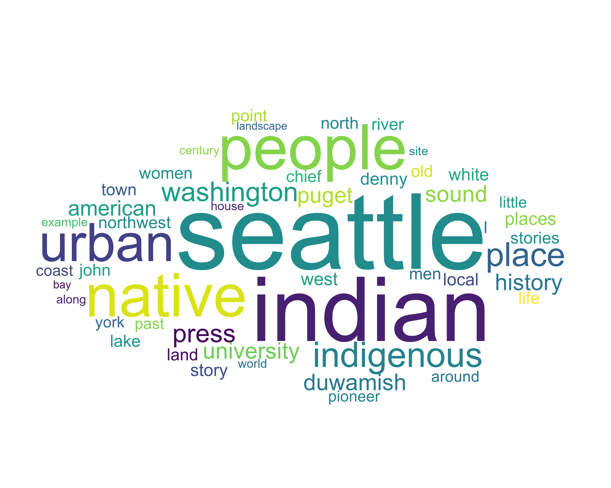
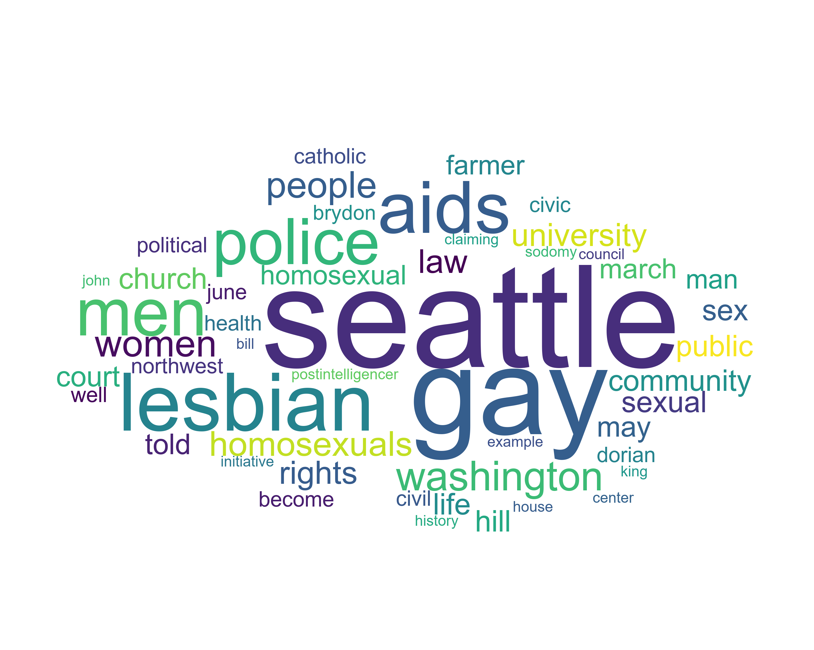
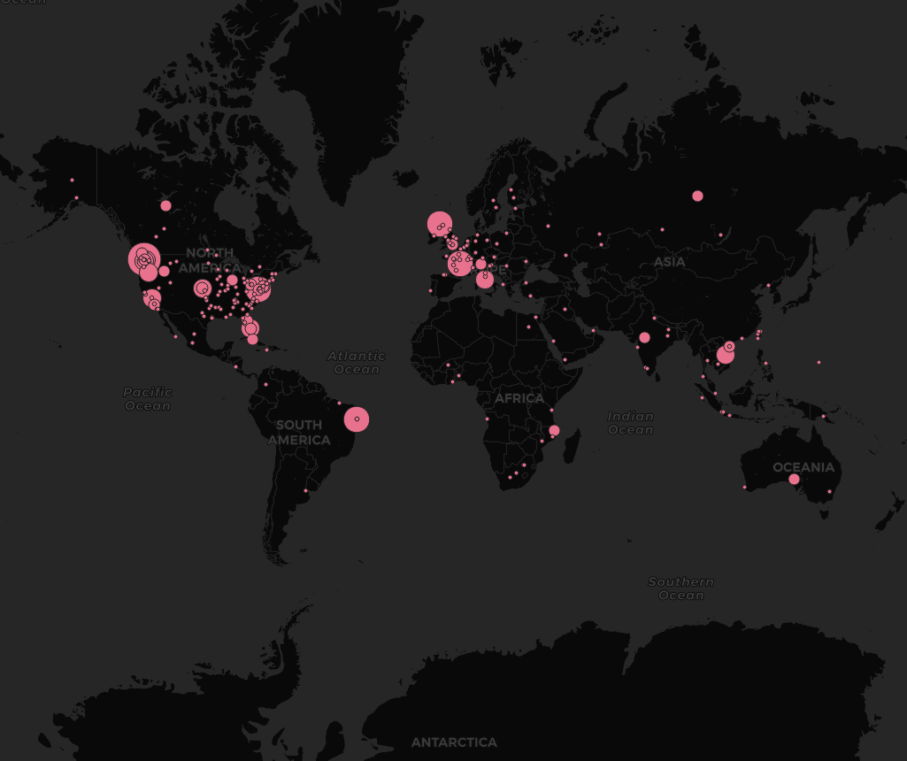

# GeoAI

**Meeting:** Wednesdays, 2:30 - 5:20, SMI 109

**Instructor:** Bo Zhao, SMI 416B, Office hours by appointment

**Contact:** 206.685.3846, zhaobo@uw.edu, jakobzhao (skype/wechat)

**Student:** Oliver Nie
In this practical exercise, we are using Natural Language Processing to explore two books and the authors' sense of place about Seattle. Natural Language Processing (NLP), as a typical machine learning algorithm, aims to interpret the context of a large text corpora. Obviously, NLP can learn a large amount of text with ease, and can summarize its major context using multiple functions and analyses. Sense of place indicates an individual's perception, emotion,  or altitude towards a place. If an individual has recorded one's sense of place, it is possible to interpret the author's sense of place to process the record using NLP. These two books are "native Seattle" and "gay Seattle". Although these two books are focusing on the same location, their true intentions and the use of words for further convention shall be varied. Thus, we can take a quick look at our maps. According to our map of key words and their spatial distance relative to its frequency, it is obvious to compare the difference. "Gay Seattle" seems to emphasize on the homosexual relationship, and it has a strong bound to politics. On the other hand, "Native Seattle" commonly uses words like "people, Indian, native and history", which is more historical study and cultural background instead of political pursuit.

Furthermore, we also have two pdf for the world map. It does shows a similar spatial relationship from a world wide perspective. What we have are a commonly appeared international topics. Both articles are western centered topic, which is why there are less mentions for places in Asia or Africa. However, the topic of homosexuality has a way bigger influence or acknowledgment in Europe than "Native Seattle". This is also somehow we expected. The study of homosexual identity is a worldwide topic in recent years, and people in Europe are more liberal(support/document) than people in Asia. On the other hand, the study of "Native Seattle" is a topic mainly focusing on Seattle. It makes sense for have a less influential spread internationally. 

