# Practical Exercise 5: Place context analysis using Natural Language Processing

**Meeting:** Wednesdays, 2:30 - 5:20, SMI 109

**Instructor:** Bo Zhao, SMI 416B, Office hours by appointment

**Contact:** 206.685.3846, zhaobo@uw.edu, jakobzhao (skype/wechat)

In this practical exercise, you are expected to use Natural Language Processing to explore a book author's sense of place about Seattle. Natural Language Processing (NLP), as a typical machine learning algorithm, aims to inteprete the context of a large text corpora with the support from insteading of a human being. Obviously, NLP can learn a large amount of text with ease, and can summarize its major context using multiple functions and analyses. Sense of place indicates an individual's perception, emotion,  or altitude towards a place. If an individual has recorded one's sense of place, it is possible to interprete the author's sense of place to process the record using NLP. Below, we will explore Gary L. Atkins's sense of place about Seattle. To do so, we will mainly use NLP to process his book entitled *Gay Seattle*. Specificially, we plan to explore multiple perspectives of Gary's sense of place. For example, we would like to get a general picture about his impression of Seaettle using word cloud, and then plot the spatial dimension of Gary's perception of `Seattle`, and then try to visualize Gary's sense of palce using network analysis. Let us get started!

## 1.  Environment Setup

This execerise will be conducted in a python programming environment. Before impelmenting this exerciese, a few python libraries are needed. To install, please execute the following line on command prompt or terminal.

```powershell
pip install PyMuPDF
pip install tika
pip install gensim
pip install spacy
pip install nltk
pip install wordcloud
pip install numpy==1.17.0
python -m spacy download en_core_web_sm
```

To make sure NLTK run property, you need to download the NLTK corpora dataset.Run the Python interpreter and type the commands.

```Python
>>> import nltk
>>> nltk.download()
```

In addition to configure the python environment, install Gephi and QGIS 3.

Gephi is an open-source network analysis and visualization software package written in Java on the NetBeans platform. Gephi has been used in a number of research projects in academia, journalism and elsewhere, for instance in visualizing the global connectivity of New York Times content and examining Twitter network traffic during social unrest along with more traditional network analysis topics. Gephi is widely used within the digital humanities (in history, literature, political sciences, etc.), a community where many of its developers are involved.


## 2. Reading and Preprocessing PDF files

 In this section, we need to read all the pdf files of the book *Gay Seattle*, please download all the pdf files from the Google drive and store them in the folder named as `gay-seattle` under the `assets` folder. Additionally, create a folder called `delFrontPage` under the same folder. After migrating files, we need to delete the front page of each pdf file since this page, containing the meta data of the pdf file, is irrelevant to the maintext of this book. Then, the python script recognizes the text of each pdf file using a python library `pika`. In the end, all the text will be stored in an text file named `gay-seattle.txt`.
#### 010_text_reader.py
As you may notice, every PDF file you downloaded starts with the same page, which contains information about the book's publication. However, we do not want to include such data in our text analysis. Therefore we will delete all the first pages using the following code:

```Python
# delete the front page of each pdf file
for pdf in pdfs:
    pdfHandle = fitzOpen(bookPath + '/' + pdf)
    pages = list(range(pdfHandle.pageCount))
    pages.pop(0)
    pdfHandle.select(pages)
    pdfHandle.save(delFrontPagePath + '/' + pdf)
    pdfHandle.close()
```

In order to read text data from PDF, we use `parser` in `tika` library:

```Python
# read the content of each pdf and make a text file contains the entire book content.
content = parser.from_file(delFrontPagePath + '/' + pdf)['content']
    try:
        print(content)
        with open(txtPath, 'a', encoding='utf8') as output:
            if content is not None:
                output.write(content)
    except AttributeError as error:
        print(error)
```

Now we have text data extracted and stored in `gay-seattle.txt`. Before we start analyzing the text, we need to 'clean' the data.
####020_text_preprocess.py
You may notice that in `gay-seattle.txt` there are a lot of white spaces and empty blanks between lines. Lets delete them.

```Python
# delete the white spaces
txt = " ".join(txt.split())
```

We also need to convert all the letters to lowercase. This is because during text processing, same words with different capitalization will be counted independently. For example, `Seattle`, `seattle`, and `SEATTLE` all have the same meaning and we want to treat them as one word instead.

```Python
# Convert text to lowercase
txt = txt.lower()
```
####030_model_builder.py
Now we have preprocessed data ready to use. Before we can create language model for natural language processing, we need to remove unwanted characters and words from our text data. This includes non-letters and stop words (the, is, not, etc...).

```Python
def review_to_wordlist(review, remove_stopwords=False):
    # Function to convert a document to a sequence of words,
    # optionally removing stop words.  Returns a list of words.
    #
    # 1. Remove HTML
    # review_text = BeautifulSoup(review, 'html5lib').get_text()
    #
    # 2. Remove non-letters
    review_text = re.sub("[^a-zA-Z]", " ", review)
    #
    # 3. Convert words to lower case and split them
    words = review_text.lower().split()
    #
    # 4. Optionally remove stop words (false by default)
    if remove_stopwords:
        stops = set(stopwords.words("english"))
        words = [w for w in words if not w in stops]
    #
    # 5. Return a list of words
    return words
```
After that, we will tokenize each sentences as well as each words using tokenizer provided by NLTK module.
```Python
# Define a function to split a review into parsed sentences
def review_to_sentences(review, tokenizer, remove_stopwords=False):
    # Function to split a review into parsed sentences. Returns a
    # list of sentences, where each sentence is a list of words
    #
    # 1. Use the NLTK tokenizer to split the paragraph into sentences
    raw_sentences = tokenizer.tokenize(review.strip())
    #
    # 2. Loop over each sentence
    sentences = []
    for raw_sentence in raw_sentences:
        # If a sentence is empty, skip it
        if len(raw_sentence) > 0:
            # Otherwise, call review_to_wordlist to get a list of words
            new_sentence = review_to_wordlist(raw_sentence, remove_stopwords)
            if new_sentence != [] and new_sentence != [u'none']:
                sentences.append(new_sentence)
    # Return the list of sentences (each sentence is a list of words,
    # so this returns a list of lists
    return sentences
```
Finally, we can train our own language model using the data we have been preparing. We will also save the created model for later use.

```Python
# train a model
    print("creating a model...")
    model = Word2Vec(doc, workers=cpu_count())
    model.save(modelPath)
    print("completed!")
```
####031_model_test.py
Now, with the model we have created, we can get a list of words that are closer to 'seattle' or get a similarity distance between words of your choice.
```Python
# test model
print('loading model...')
model = Word2Vec.load("assets/gay-seattle.w2v")
print("seattle", model.wv.most_similar('seattle', topn=50))
print(model.wv.distances('seattle', ('news', 'june', 'times', 'march')))
```
Carefully examine what words appears and think about why these words are the 'closest' words. You may change the input word to see what kind of words are closer each other.
## 3. Making a Wordcloud
####040_word_cloud_creator.py
Now let's visualize the context of our data using word frequencies and wordcloud.

In previous part, we have preprocessed our text data, but we need a bit more of cleaning our data. We will remove punctuations and numbers from our text, because we do not want to include them in our wordcloud.

```Python
# Remove numbers
txt = re.sub(r'\d+', '', txt)

# Remove punctuation
txt = re.sub(r'[^\w\s]', '', txt)
```

Moreover, we will replace some of the words with their root form to avoid having similar words in our data. In this example, we will replace 'gays' with 'gay', 'lesbians' with 'lesbian', and etc...

```Python
txt = txt.replace("gays", "gay").replace("lesbians", "lesbian").replace("seattles", "seattle").replace("citys", "city")
```

We can also modify the list of stopwords to remove from our original text. Let's remove some of the frequently appearing words that are irrelevant to our context.

```Python
stopwords = set(STOPWORDS)
commonwords = {"time", "one", "began", "among", "another", "see", "part", "many", "day", "day", "way", "times",
               "still", "news", "three", "came", "became", "made", "wanted", "seemed", "made", "now", "society",
               "ing", "time", "first", "new", "called", "said", "come", "two", "city", "group", "state", "year",
               "case", "member", "even", "later", "month", "years", "much", "week", "county", "name", "example"
               "well", "members", "us", "say", "s"}
stopwords.update(commonwords)
```
Before producing wordcloud, let's take a look at word frequency table. Following piece of code prints out frequency table for us.

```Python
# tokenize and calculate the word frequencies
tokens = nltk.tokenize.word_tokenize(txt)
fDist = FreqDist(tokens)
print(fDist.most_common(20))

# remove the stop words and common words
filtered_fDist = nltk.FreqDist(dict((word, freq) for word, freq in fDist.items() if word not in stopwords))

print(filtered_fDist)
filtered_fDist.plot(20)
```
Here is a preview of the word frequency graph we obtained:


Let's also produce wordcloud. `wordcloud` module lets us create a wordcloud using frequency data. We can also set a mask image to change what shape the wordcloud will form.
```Python
print("generating wordcloud...")
mask_array = npy.array(Image.open("img/cloud.jpg"))
wc = WordCloud(font_path='arial', background_color="white", max_words=50, prefer_horizontal=1, mask=mask_array, scale=3, stopwords=stopwords, collocations=False)
wc.generate_from_frequencies(filtered_fDist)
wc.to_file(wcPath)
print("completed!")
```
The generated wordcloud image is saved in `img` folder with fike name `gay-seattle.png`. Here is the preview. We now have a better sense of what the context of this book is about.

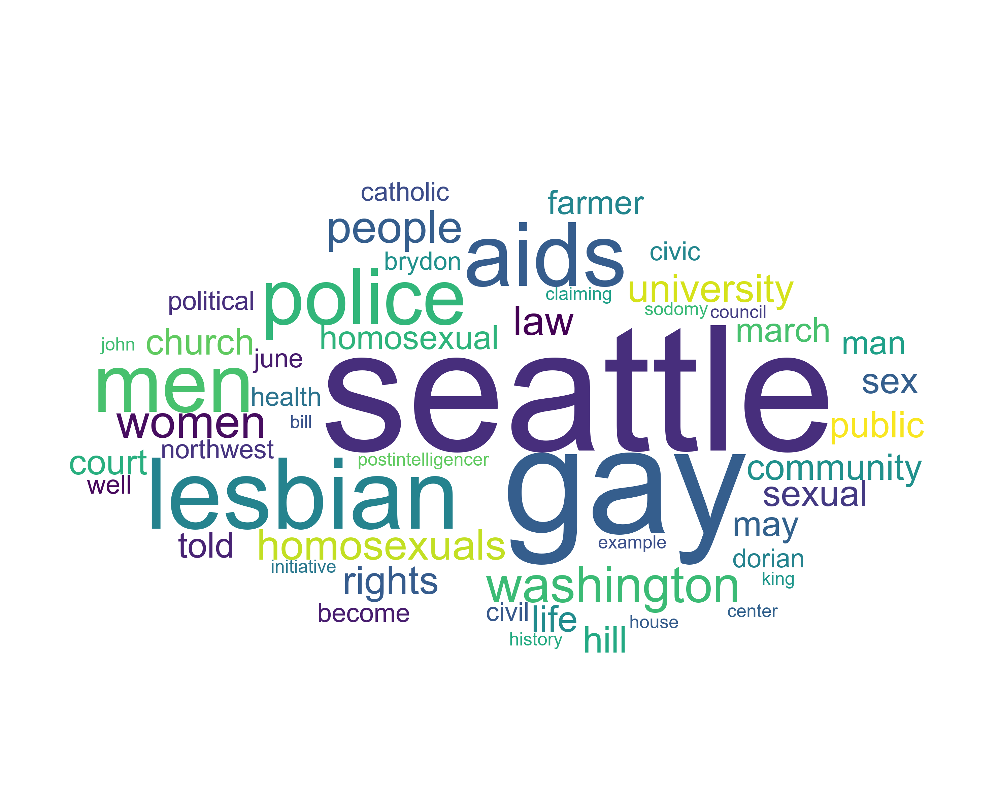

## 4. Spatial dimension of sense of place
####051_spatial_dimension.py
Now, let's analyze this text from another aspect: spatial dimension of sense of place. A sense of place is a characteristic that some geographic places have and some do not, while to others it is a feeling or perception held by people. It is often used in relation to those characteristics that make a place special or unique, as well as to those that foster a sense of authentic human attachment and belonging. Spatial simension of sense of place is a similar concept except that it is focused on spatial connections and relationship with other places.

To perform this analysis, we will use a NLP package `spaCy` and its provided language model. We care going to use a language model called `en_core_web_sm`, but before we can use them, we need to download it manually using terminal.

```terminal
python -m spacy download en_core_web_sm
```

Then, we load the language model and make a NLP object used to create documents with linguistic annotations.

```Python
nlp = spacy.load("en_core_web_sm")
nlp.max_length = len(txt)
my_doc = nlp(txt)
```

We also remove stopwords and lemmatize each word. Lemmatization is a process of grouping together the inflected forms of a word so they can be analysed as a single item, identified by the word's lemma, or dictionary form.

```Python
# removing stopwords
print("removing stop words...")
filtered_sent = []
for word in my_doc:
    if not word.is_stop:
        filtered_sent.append(word)
print("Filtered words: ", filtered_sent)

# lemmatization
print("lemmatizing...")
lemma_sent = []
for word in filtered_sent:
    lemma_sent.append(word.lemma_)
print("lemmatized data: ", lemma_sent)
processedTxt = " ".join(lemma_sent)
processedDoc = nlp(processedTxt)
```
`spaCy` provides a nice feature called entity detection, which tells us what entity each term belongs to. For example, 'John' is a person, 'supreme court' is an organization, and 'seattle' is a place. When we created our NLP object, each words are already tagged according to their entity. We are only interested in locations and places, which are tagged `GPE`, which refer to geopolitical entity. We will extract such vocabularies from our text.

```Python
geoTxt = ""
for ent in processedDoc.ents:
    print(ent.text, ent.start_char, ent.end_char, ent.label_)
    if ent.label_ == "GPE":
        geoTxt += ent.text.replace(" ", "") + " "
```
Then, we tokenize and save the calculated word frequencies to `gay-seattle-places.csv` for geocoding.
```Python
tokens = nltk.tokenize.word_tokenize(geoTxt)
fDist = FreqDist(tokens)
with open("assets/gay-seattle-places.csv", "w", encoding="utf8") as fp:
    for item in fDist.most_common(300):
        try:
            fp.write("%s, %d\n" % (item[0].replace("county", " county").replace("state", " state").replace("city", " city"), item[1]))
            print(item)
        except TypeError as error:
            pass
print("finished!")
```

####052_geocoding.py
Geocoding means to provide geographical coordinates corresponding to a location. With location names extracted from text, we can perform geocoding to get their corresponding longitude and latitude. `geocoder` module provide a free geocoding tool without having users provide API keys.

```Python
import geocoder

with open("assets/gay-seattle-places-geocoded.csv", "w", encoding="utf8") as geofp:
    geofp.write("name, frequency, lat, lng\n")
    with open("assets/gay-seattle-places.csv", "r", encoding="utf8") as fp:
        for line in fp.readlines():
            location = line.split(",")[0]
            freq = int(line.split(",")[1])
            try:
                g = geocoder.arcgis(location)
                lat = g.current_result.lat
                lng = g.current_result.lng
                geofp.write("%s, %d, %f, %f\n" % (location, freq, lat, lng))
                print(location, freq, lat, lng)
            except:
                pass
print("finished!")

```

Now we have location data stored in a file named `gay-seattle-places-geocoded.csv` under `assets` folder. In next step, we will project each data point with longitude and latitude onto a map using mapping tool called QGIS. If you do not have QGIS installed, you can download it from [here](https://qgis.org/en/site/forusers/download.html).

The first step of mapping our data is to add base map. A base map is a layer with geographic information that serves as a background. A base map provides context for additional layers that are overlaid on top of the base map. We first need to download plugin that provides different base maps. After you open a new project in QGIS, navigate yourself to `Plugins > Manage and Install Plugins`. It will open a window like this:

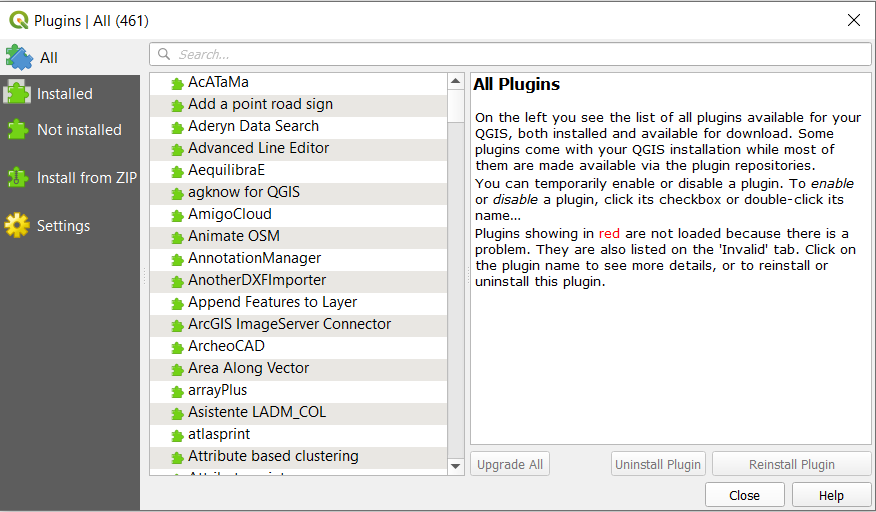

In the search bar, type in `QuickMapServices` and install the plugin. After installing it, close the plugins window. Navigate yourself to `Web > QuickMapServices > Settings`. You should see a page like this:

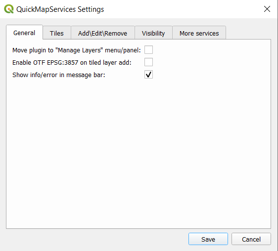

Click on `More Services` tab and click on `Get contributed pack`. Then, close the page and navigate yourself again to `Web > QuickMapServices`. This time, you will see a list of contributors and basemaps that they provide. Feel free to try adding different baseemaps, but for our exercise, let's use a basemap called `Dark Matter (retina)` under `CartoDB`.

After adding the basemap, it should look like this:

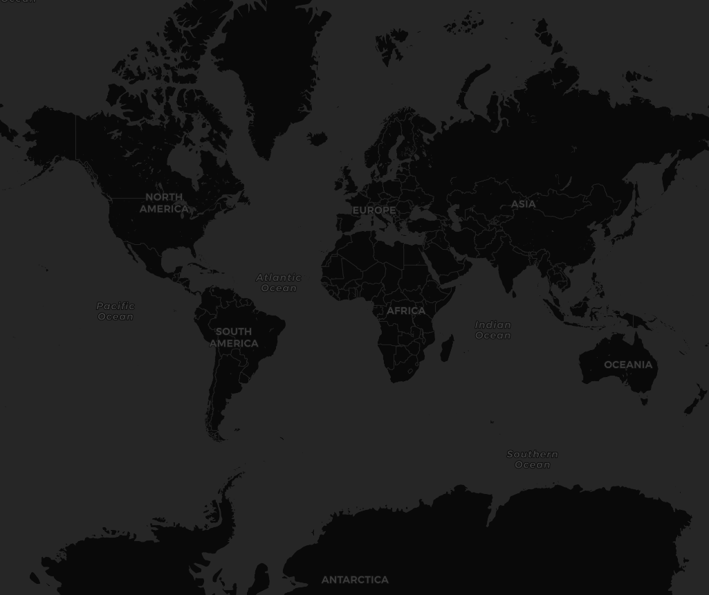

Now let's project the data we collected to this basemap. Click on `Layer > Add Layer`. You will see different ways of adding a layer. In our case, we would like to add data stored in csv file, which is a delimited text file. Therefore, choose  `Add Delimited Text Layer`. In file name section, choose the file named `gay-seattle-places-geocoded`. Expand `Geometry Definition` tab, set X field as `lng` and set Y field as `lat`. Choose CSV as file format and leave everything else as default.

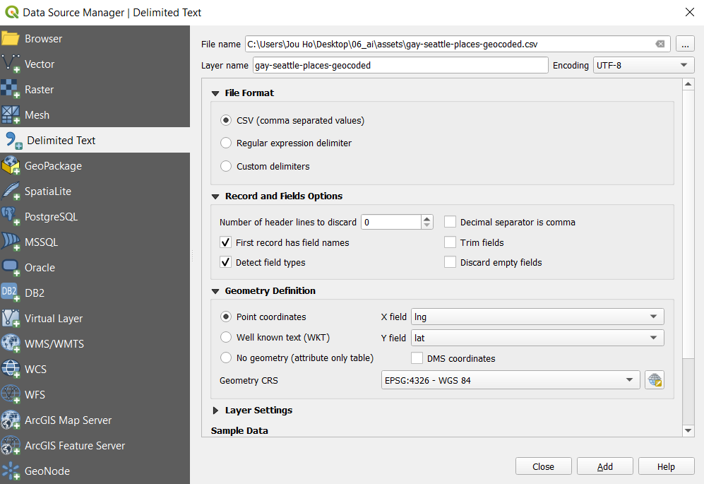

After adding the layer, close your data source manager. Your map should look something like this:


We can now see geocoded locations that are spatially connected to our book's context on the map. However, one location might be mentioned more than once in the book while others are mentioned only once. In order to present our data more accurately, let's change the size of our points proportional to how many times they are mentioned in the text.

Right click on `gay-seattle-places-geocoded` layer and click on `properties`. It will pop up a page with many tabs on its left side. Click `Symbology` tab. Change the selection on very top from `Single Symbol` to `Graduated Symbol`. This will allow each data point to be represented differently according to a variable you choose. `Column` variable changes which variable your data points will be presented according to. Since we want to change the size of our data points according to their frequencies that they are mentioned, choosee `frequency`. Also, change the `method` variable from `color` to `size`. We could also use color to show different frequencies, and feel free to try it out. Before we click apply, we need to claddify our data to determine which values of frequency correspond to which size of data points. Under `classes` tab, change the classification mode to `Natural Breaks (Jenks)` and click `Classify`.
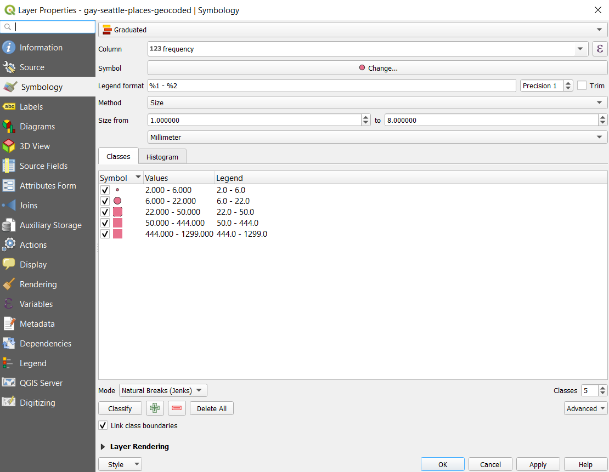

 Now, we can hit `Ok` and see the change. We can see that the context of this book is spatially connected not just to Seattle area, but also connected to worldwide locations including Europe, Africa, South America, and etc.


## 5. Social Network analysis
#### 060_semantic_dimension.py
Social network analysis [SNA] is the mapping and measuring of relationships and flows between things like people, groups, organizations, computers, URLs, and other connected information/knowledge entities. The nodes in the network are the subjects while the links show relationships or flows between the nodes. We can use this technique with language model we created to map semantic relationships between words, or the semantic dimention of the vacabularies in the book.

First, we load the text we have been using.

```python
processedTxtPath = "assets/gay-seattle-processed.txt"
```

We would again preprocess our text data and update our stopwords as follows.

```Python
txt = " ".join(txt.split())
txt.translate({ord(c): None for c in string.whitespace})
txt = txt.replace("gays", "gay").replace("lesbians", "lesbian").replace("seattles", "seattle").replace("citys", "city")
stopwords = set(STOPWORDS)
commonwords = {"time", "one", "began", "among", "another", "see", "part", "many", "day", "day", "way", "times",
               "still", "news", "three", "came", "became", "made", "wanted", "seemed", "made", "now", "society",
               "ing", "time", "first", "new", "called", "said", "come", "two", "city", "group", "state", "year",
               "case", "member", "even", "later", "month", "years", "much", "week", "county", "name", "example"
               "well", "members", "us", "say", "s"}
stopwords.update(commonwords)
```
Then, we remove the updated stopwords and tokenize the text.

```Python
# tokenize and calculate the word frequencies
tokens = nltk.tokenize.word_tokenize(txt)
fDist = FreqDist(tokens)
# print(fDist.most_common(20))

# remove the stop words and common words
filtered_fDist = nltk.FreqDist(dict((word, freq) for word, freq in fDist.items() if word not in stopwords))
```

We then load the language model we created before and create a graphing object used for social network analysis.

```Python
print('loading model...')
model = Word2Vec.load("assets/gay-seattle.w2v")
g = nx.DiGraph()
```

Since we can get similar words to each words in the text using our model, we will write a semantic relation map to our graphing object by adding nodes (each words) and edges (lines connecting each nodes). We can also add weight to each edges showing how strong the connections are.

```Python
items = filtered_fDist.most_common(50)
for item in items:
    g.add_nodes_from(item[0])
    try:
        mswords = model.wv.most_similar(item[0], topn=25)
        for msword in mswords:
            g.add_nodes_from(msword[0])
            g.add_edge(item[0], msword[0], weight=msword[1])
            print("%s --> %s: %8.5f" % (item[0], msword[0], msword[1]))
    except KeyError as error:
        print(error)
```

We will save this graphing onject as `gexf` file, which can be used to graphically generate a social network analysis map.

```Python
nx.write_gexf(g, "assets/gay-seattle.gexf", encoding='utf-8', prettyprint=True, version='1.1draft')
print("finished!")
```

`Gephi` is the graphing tool we will use to draw our social network analysis. If you do not have `Gephi` installed, you can download it from this [link](https://gephi.org/users/download/). Once you have Gephi downloaded, create a new project and open the `gefx` file we just careated. You will see a windown like this:

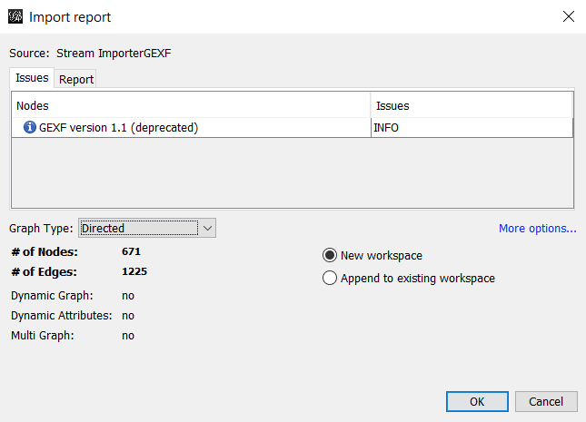

Make sure that your `Graph Type` is set to `Directed`, and click `Ok`.
After you load the file, you will see a lot of nodes clustered together like this.

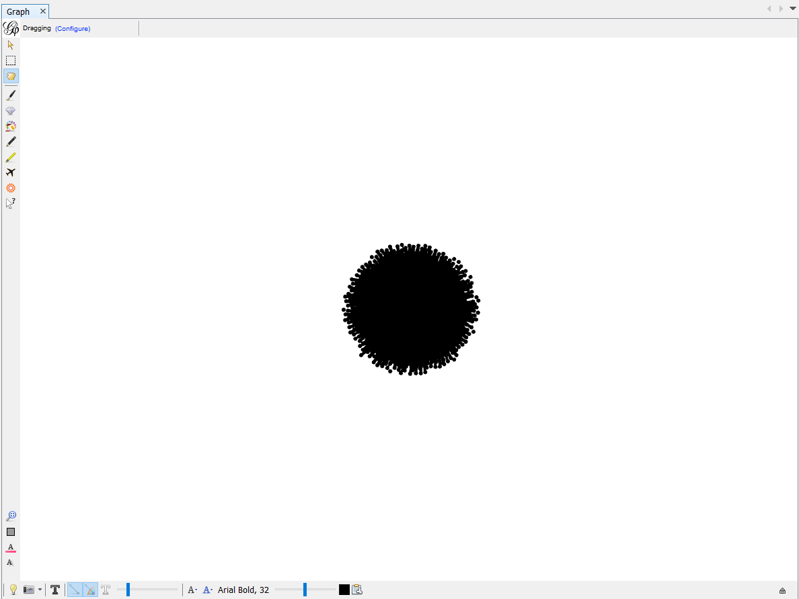

This graph does not make any sense yet. We need to calculate the `Modularity` of this cluster of nodes in order to classify this cluster into different groups. `Modularity` is a community detection algorithm built inside `Gephi`. There are different algorithms built in for you to calculate on the right side of the page. Choose `Modularity` and click on `Run`. When you run it, make sure you click on the box that says `Use Weights`. This makes sure that we classify different clusters based on edge weight, or how many connections a node has. After calculating, a page showing result pops up. You may inspect the distribution of different clusters and other information, but how now you may close the result page.

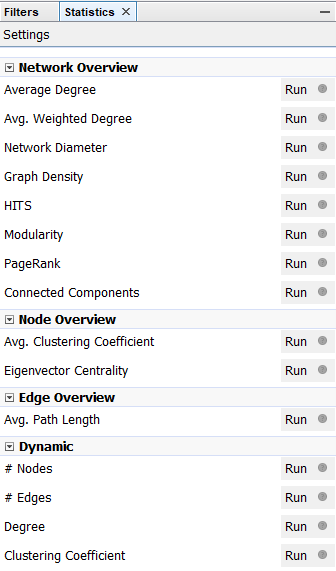

Now, navigate yourself to the top-left corner of the screen. You will see a `Appearance` window where you can edit the symbology of each nodes or edges. In order to classify our clusters based on `modularity`, click `Nodes > Partition > Choose an Attribute`, choose `Modelarity Class` and click on `Apply`.

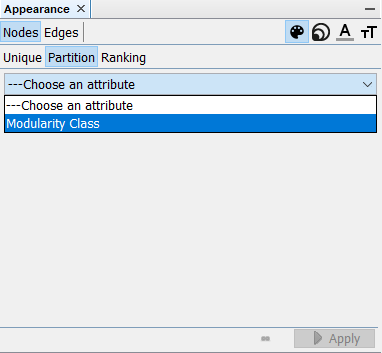

Each nodes are now colored based on calculated modurarity.

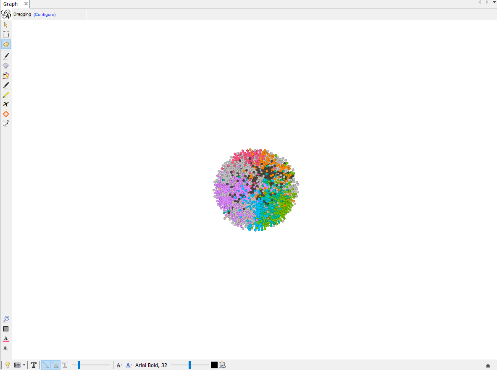

We would also like to change the size of nodes based on how many edges they each have. To do this, click on `size` tab on top right of the same windon and click `Nodes > Ranking > Choose an Attribute > Degree`.

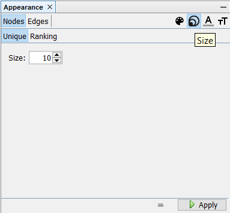

Click `Apply`and now we can see some nodes are bigger than others. These nodes have more connections than others and thus they are at the center of each classified clusters.

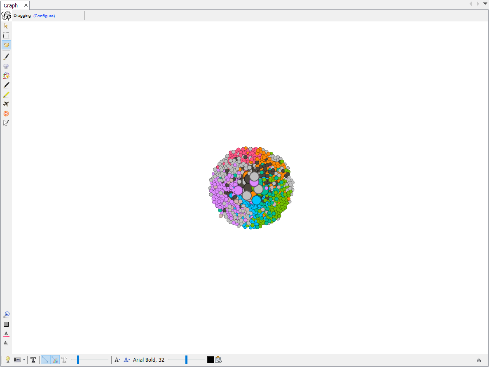

Now let's organize these nodes so that we can see what vocabulary each nodes represents. We will also make each clusters positioned seperately without overlap to make this map look nicer.

To change the layout, find `layout` window on the bottom-left of the screen. There are different layout methods you can choose from. Feel free to try different ones on your own, but let's choose `ForceAtlas 2` for this time.

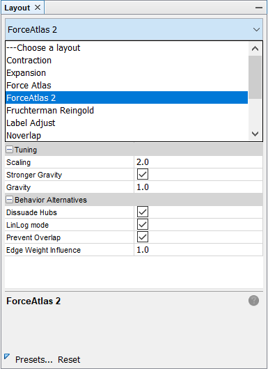

There are many variables you can change to change your layout. Look into each of the variables and feel free to change them as you want. You can also reference our example below.

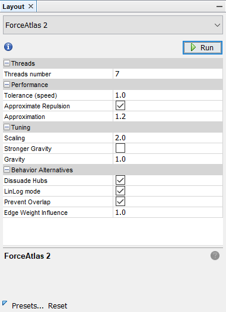

After setting your values for each variable, click `Run`. You will see each nodes start moving and click `stop` when they are in good shape and stop moving. your Graph should now look something like this.

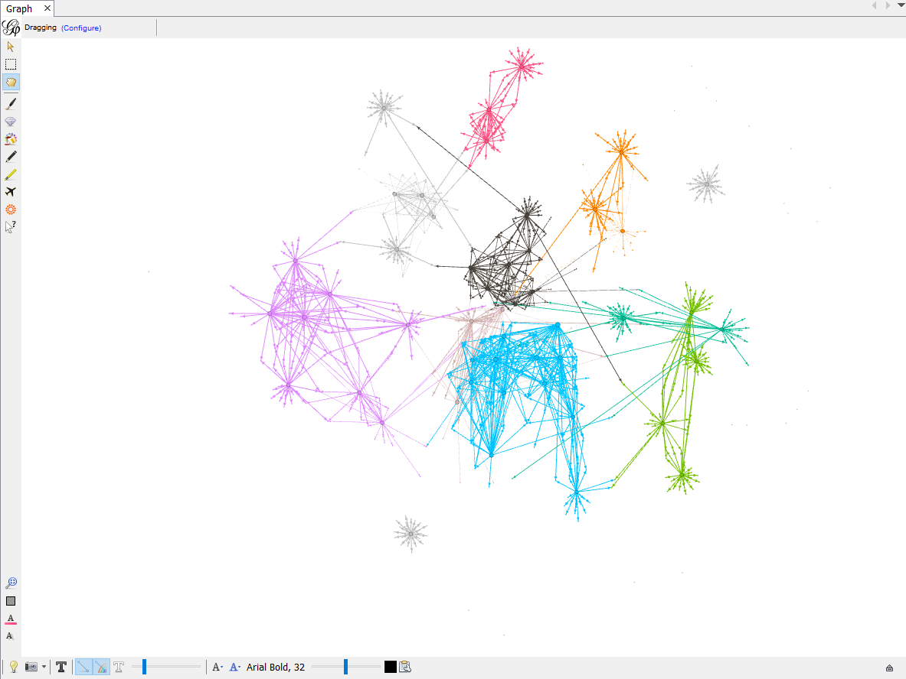

Now, let's switch our page to `Preview` by clicking `Preview` on the top-left of the page. You probably do not have anything yet for your preview. We need to configure our preview first in order to generate a nice-looking social network map. Click `Default` and choose `Text Outline` and click `Refresh`.

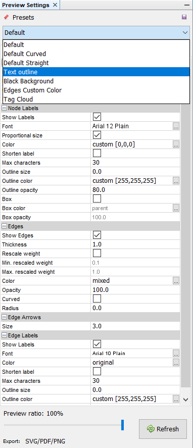

Your map will look something like this:

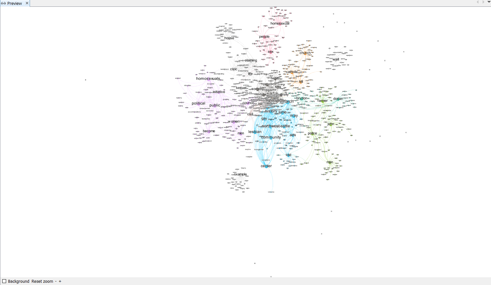

You may realize that there are nodes lying far beyond our cluster groups. These nodes are irrelevant nodes representing single characters like `a`, `b`, `c` and etc. In order to delete these points, switch your page to `Data Laboratory` by clicking it on top-left of the screen.

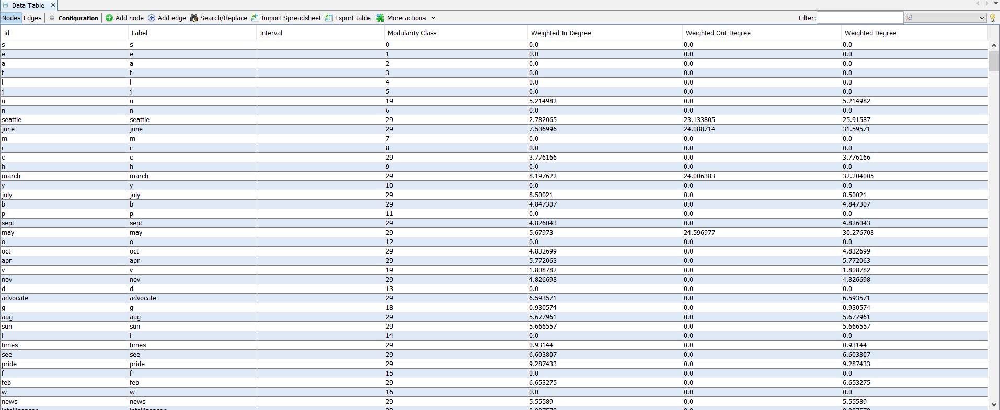

We can see aforementioned nodes. Since there are only countable number of such nodes, we can delete these nodes manually by simply selecting it and press `del` key. You can also delete them by left-clicking them and choose `delete`. After deleteing them, switch back to `Preview` page, `Refresh` the preview and click `Reset Zoom`. Your map should now look like this:

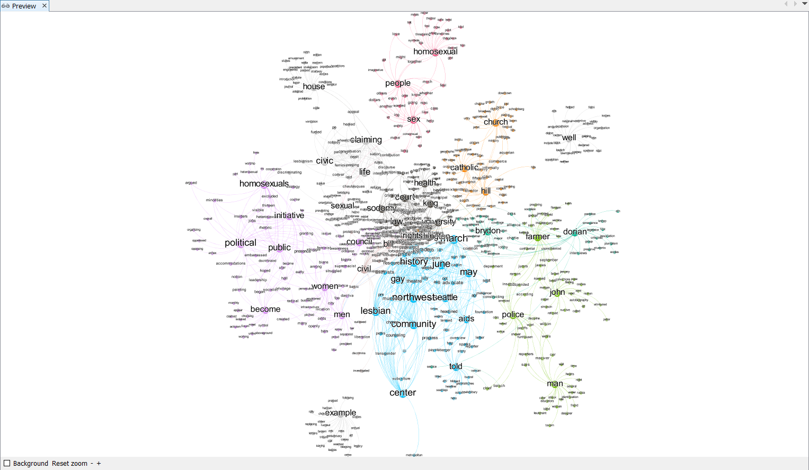

You are encouraged to change the preview setting to make this network look clearer and nicer. Explore different setting and create a visually appealing social network map! Below is an example of a completed map.

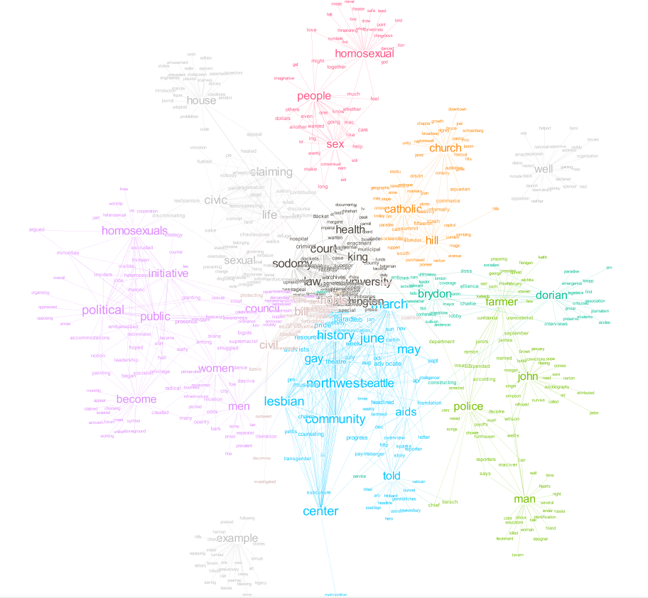

#### 061_wordembedments.py
Finally, we are going to visualize the word embeddings. The word embeddings made by the model can be visualised by reducing dimensionality of the words to 2 dimensions using tSNE. More details on how this is done can be found at https://radimrehurek.com/gensim/auto_examples/tutorials/run_word2vec.html#sphx-glr-auto-examples-tutorials-run-word2vec-py.

First, we reduce the dimensionality of the words using tSNE.

```Python
def reduce_dimensions(model):
    num_dimensions = 2  # final num dimensions (2D, 3D, etc)

    vectors = [] # positions in vector space
    labels = [] # keep track of words to label our data again later
    for word in model.wv.vocab:
        vectors.append(model.wv[word])
        labels.append(word)

    # convert both lists into numpy vectors for reduction
    vectors = np.asarray(vectors)
    labels = np.asarray(labels)

    # reduce using t-SNE
    vectors = np.asarray(vectors)
    tsne = TSNE(n_components=num_dimensions, random_state=0)
    vectors = tsne.fit_transform(vectors)

    x_vals = [v[0] for v in vectors]
    y_vals = [v[1] for v in vectors]
    return x_vals, y_vals, labels


x_vals, y_vals, labels = reduce_dimensions(model)
```

We basically generated an x-coordinates and y-coordinates for each words. Now let's plot them using `pyplot` module.

```Python
def plot_with_matplotlib(x_vals, y_vals, labels):
    import matplotlib.pyplot as plt
    import random

    random.seed(0)

    plt.figure(figsize=(64, 64))
    plt.scatter(x_vals, y_vals)

    #
    # Label randomly subsampled 25 data points
    #
    indices = list(range(len(labels)))
    selected_indices = random.sample(indices, 100)
    for i in selected_indices:
        plt.annotate(labels[i], (x_vals[i], y_vals[i]))
    plt.show()


plot_with_matplotlib(x_vals, y_vals, labels)
print("finished")
```

#### 062_word_vis.py
You will notice that the generated map is crowded with points, and we can barely read the graph. Instead of using pyplot to plot these xy-coordinates, we can use a mapping tool called `QGIS` to map them. If you do not have `QGIS` installed, here is the [link](https://qgis.org/en/site/forusers/download.html).

In this python program, we would repeat the same process, and save the xy-coordinates in a csv file as `gay-seattle-pnts.csv`.

```Python
with open("assets/gay-seattle-pnts.csv", "w+", encoding="utf8") as fp:
    i = 0
    fp.write("id, x, y, freq, label\n")
    for label in labels:
        fp.write("%d, %f, %f, %d, %s\n" % (i, x_vals[i], y_vals[i], fDist[label], label))
        i += 1

print("finished!")
```

The rest is very similar to what we did ealier for geocoding. Once you have your empty project open, add our data by choosing `Layer > Add Layer > Add Delimited Text Data`. Choose `gay-seattle-pnts.csv` and the system should recognize xy fields for you this time. Leave all the settings default and click `Add`.

You should see a similar map you created using pyplot. Let's change our symbology by left-clicking on the newly added layer and choosing `properties > symbology`. We can change each points' color by their frequency variable. To do so, change `single symbol` to `graduated symbol` and choose `freq` for column variable. Classify them into different color ramps similarly to what we did for geocoding and hit `apply`. Now they are colored based on frequency.

Finally, we can label each points showing what term each points represent. Left-click again on the layer and click `properties > label`. Change `No Labels` to `Single Label` and choose `label` for `label with` variable. now your map should look like this:

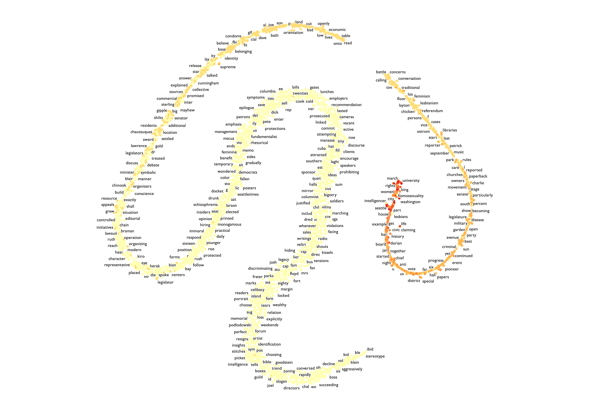

We can read each points clearly if you zoom in.
## Deliverable


## References
* Thrush, C., 2017. Native Seattle: Histories from the crossing-over place. Accessed from https://muse.jhu.edu/book/10411. University of Washington Press.

* Atkins, G., 2011. Gay Seattle: Stories of exile and belonging. Accessed from https://muse.jhu.edu/book/40703. University of Washington Press.
